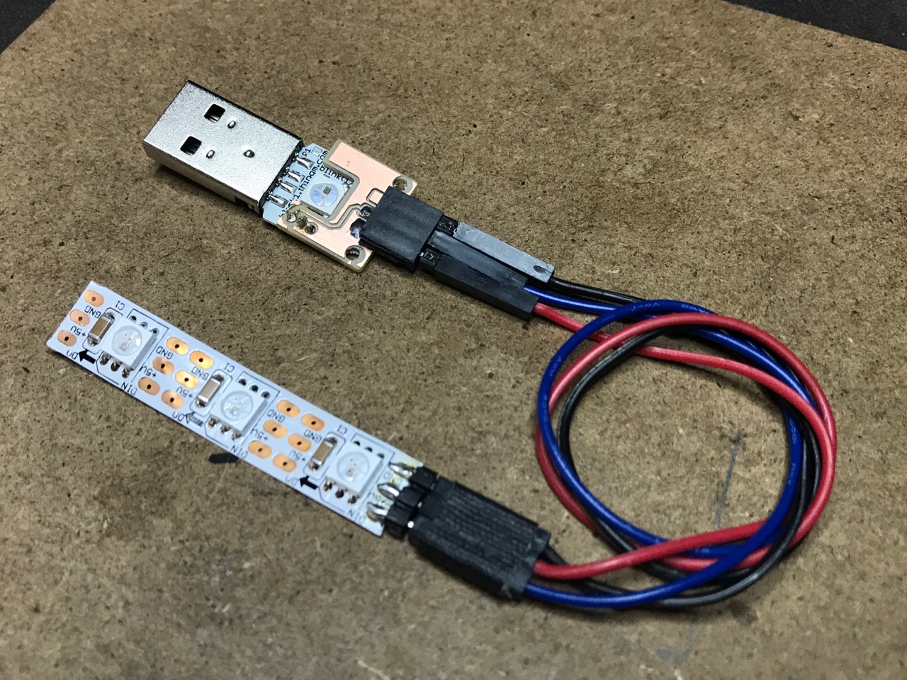

blink(1) adapters
=================

Little hardware add-ons to blink(1) USB RGB LED to allow more LEDs to be used.

* https://oshpark.com/projects/2awZS2hw

Also see:

* https://blog.thingm.com/2017/01/adding-neopixels-ws2812-leds-to-blink1/
* https://blog.thingm.com/2014/09/blink16-prototype-is-woody-and-awesome/

* https://blink1.thingm.com/

